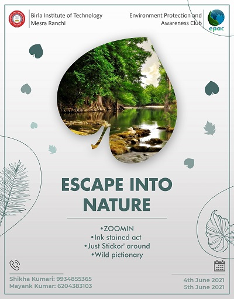

# Epac-Website

## Editing Index(Home) Page of the Website

### Editing the Navigation bar Section (Adding New Pages to the Website)
```
        <!----Navigation---->
        <div class="nav-links" id="nav-links">
          <i class="fa fa-times" onclick="hidemenu()"></i>
          <ul>
            <li><a href="index.html">Home</a></li>
            <li><a href="teams.html">Our Team</a></li>
            <li><a href="Alumni.html">Alumni</a></li>
            <li><a href="gallery.html">Gallery</a></li>
            <li><a href="contact.html">Contact Us</a></li>
          </ul>
        </div>
```
Create New Pages,upload html,css files of those Pages in Repositry and add a new list in the above code with href referring to html page.(New pages can also be created using Notion.)

### Editing the Our Events Section
```
 <!-----Events---->
    <div class="ef">
      <section class="events">
        <h1>Our Events</h1>

        <div class="row">
          <div class="elist">
            <a href="https://www.facebook.com/147788775311285/posts/4025501860873271/"></a>
          </div>
          <div class="elist">
            <a href="https://www.facebook.com/epacbitmesra/"></a>
          </div>
          <div class="elist">
            <a href="https://www.facebook.com/epacbitmesra/"></a>
          </div>
        </div>
      </section>
    </div>
```
Resize the event Poster in the size (400 x 512), save it in the images folder and replace the src of image tab in above code,also replace the href of attribute tab with suitable facebook link. Update these changes in the index.html file.

## Editing Our Team Page of the Website

### Adding Members to the Team Section
```
            <div class="item">
              
              <div class="inner">
                <div class="info">
                  <h5>Ketan Raj</h5>
                  <p>Web Director</p>
                  <!--social-links -->
                  <div class="social-links">
                    <a href="https://www.facebook.com/ketan.raj.3572">
                      <span class="fa fa-facebook"></span>
                    </a>
                    <a href="https://www.linkedin.com/in/ketan-raj/">
                      <span class="fa fa-linkedin"></span>
                    </a>
                  </div>
                </div>
              </div>
            </div>
```
Resize the image of Team member in the size (700 x 892),save it in the images folder, make suitable changes in the social link division by replacing linkedin,facebook profile links.Update these changes in the teams.html file.

## Editing Gallery Page of the Website

### Adding Members to the Team Section
```
<div class="img-gallery">
        
</div>
 ```
 Resize the images for gallery in the size (540 X 540),save it in the Gallery sub-folder of images folder, and replace the src of image tab in above code.Update these changes in the gallery.html file. 

